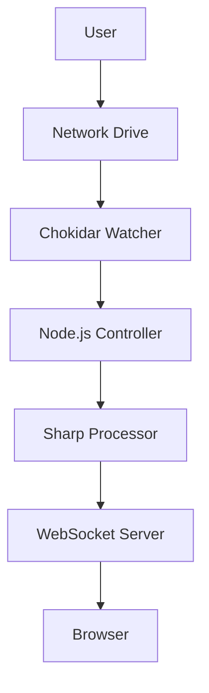

# Complete Diagrams Package - Summary

## Overview

This package contains all 9 required diagrams and documentation for your bachelor project report. All diagrams are provided in markdown format with ASCII/text representations that can be converted to visual diagrams or included directly in your report.

---

## Diagrams Included

### ✅ 1. High-Level Architecture Diagram
**File**: `DIAGRAMS/01-High-Level-Architecture.md`

**Content**:
- Hardware layer (Raspberry Pi, HDMI Screen, USB Drive)
- Software layer (Node.js Server)
- Data source (Network Drive)
- User interface (Browser/Kiosk Mode)
- Component interactions
- Network architecture

**Use For**: Section 4.1 - System Architecture Overview

---

### ✅ 2. Software Stack Diagram (Layered Architecture)
**File**: `DIAGRAMS/02-Software-Stack.md`

**Content**:
- Presentation Layer (HTML5, CSS3, Vanilla JS, WebSocket Client)
- Application Layer (Express.js, WebSocket Server, Chokidar)
- Logic Layer (Sharp, Canvas, Auth Middleware, Tesseract.js, bcryptjs)
- Data Layer (JSON Storage, File System, Image Cache)
- Technology choices rationale

**Use For**: Section 4.2 - Technology Stack

---

### ✅ 3. Sequence Diagram: Real-Time File Update
**File**: `DIAGRAMS/03-Sequence-Real-Time-Update.md`

**Content**:
- Complete flow from file addition to UI update
- Chokidar event detection
- Image processing with Sharp
- WebSocket broadcasting
- Frontend DOM update
- Timing analysis
- Code implementation

**Use For**: Section 4.3 - Real-Time Update Mechanism

---

### ✅ 4. Activity Diagram: Smart Image Optimization
**File**: `DIAGRAMS/04-Activity-Image-Optimization.md`

**Content**:
- Decision flow for image optimization
- Dimension analysis
- Resize decision logic
- Format conversion
- Thumbnail generation
- Cache strategy
- Performance metrics

**Use For**: Section 4.4 - Performance Optimization Strategy

---

### ✅ 5. Security Flowchart (RBAC)
**File**: `DIAGRAMS/05-Security-RBAC.md`

**Content**:
- Complete authentication flow
- Password hashing with bcrypt
- Session creation
- Role-based access control
- Permission matrix
- Security measures
- Error handling

**Use For**: Section 4.5 - Security Implementation

---

### ✅ 6. Data Schema Documentation (JSON Structure)
**File**: `DIAGRAMS/06-Data-Schema.md`

**Content**:
- users.json complete schema with examples
- config.json structure (40+ settings)
- layouts.json structure with widget types
- analytics.json structure
- Data relationships
- Validation rules

**Use For**: Section 4.6 - Data Storage Architecture

---

### ✅ 7. UI/UX Sitemap
**File**: `DIAGRAMS/07-UI-Sitemap.md`

**Content**:
- Complete application structure
- User journey flows
- Navigation patterns
- Page hierarchy
- Role-based access flows
- Global features

**Use For**: Section 4.7 - User Interface Design

---

### ✅ 8. Deployment Diagram
**File**: `DIAGRAMS/08-Deployment.md`

**Content**:
- Network drive architecture
- Raspberry Pi setup
- Browser kiosk mode configuration
- Startup scripts
- Multi-location deployment
- Deployment checklist

**Use For**: Section 4.8 - Deployment Architecture

---

### ✅ 9. Code Snippets (Key Algorithms)
**File**: `DIAGRAMS/09-Code-Snippets.md`

**Content**:
- Chokidar watcher configuration
- Sharp image resizing function
- WebSocket broadcast function
- Authentication middleware
- Password hashing
- Rate limiting
- File metadata extraction

**Use For**: Appendix E - Code Examples

---

## How to Use These Diagrams

### Option 1: Include as ASCII Diagrams
- Copy the ASCII diagrams directly into your report
- Works well for text-based reports
- Easy to include in markdown/Word documents

### Option 2: Convert to Visual Diagrams
1. Use diagramming tools:
   - **draw.io** (https://app.diagrams.net/)
   - **Lucidchart** (https://www.lucidchart.com/)
   - **Mermaid** (https://mermaid.live/)
   - **PlantUML** (http://www.plantuml.com/)

2. Convert ASCII to visual:
   - Copy the structure
   - Recreate in visual tool
   - Add colors and styling
   - Export as PNG/SVG

### Option 3: Use Mermaid Syntax
Some diagrams can be converted to Mermaid syntax for automatic rendering:



---

## Report Integration Guide

### Section 4: Product Development

**4.1 System Architecture**
- Include: High-Level Architecture Diagram
- Reference: Software Stack Diagram

**4.2 Technology Stack**
- Include: Software Stack Diagram
- Reference: Code Snippets

**4.3 Real-Time Updates**
- Include: Sequence Diagram
- Reference: Code Snippets (WebSocket)

**4.4 Performance Optimization**
- Include: Activity Diagram
- Reference: Code Snippets (Sharp)

**4.5 Security**
- Include: Security Flowchart
- Reference: Code Snippets (Authentication)

**4.6 Data Storage**
- Include: Data Schema Documentation
- Reference: Deployment Diagram

**4.7 User Interface**
- Include: UI/UX Sitemap
- Reference: High-Level Architecture

**4.8 Deployment**
- Include: Deployment Diagram
- Reference: All diagrams

### Appendix E: Code Examples
- Include: All Code Snippets
- Reference: Relevant diagrams

---

## Checklist for Your Report

- [x] High-Level Architecture Diagram
- [x] Software Stack Diagram
- [x] Real-Time Update Sequence Diagram
- [x] Image Optimization Activity Diagram
- [x] Security/RBAC Flowchart
- [x] JSON Data Schema Snippets
- [x] UI Sitemap
- [x] Deployment Diagram
- [x] Key Code Snippets

---

## File Locations

All diagrams are located in: `UNIFIED-APP/DIAGRAMS/`

```
DIAGRAMS/
├── 01-High-Level-Architecture.md
├── 02-Software-Stack.md
├── 03-Sequence-Real-Time-Update.md
├── 04-Activity-Image-Optimization.md
├── 05-Security-RBAC.md
├── 06-Data-Schema.md
├── 07-UI-Sitemap.md
├── 08-Deployment.md
└── 09-Code-Snippets.md
```

---

## Additional Resources

### For Visual Conversion
- **draw.io Templates**: Use "Flowchart" and "Sequence Diagram" templates
- **Mermaid Live Editor**: https://mermaid.live/ (supports sequence, flowchart, etc.)
- **PlantUML**: Supports all diagram types

### For Code Formatting
- Use syntax highlighting in your report
- Include line numbers for code snippets
- Add comments explaining key sections

### For Documentation
- Reference diagram numbers in text
- Add captions explaining what each diagram shows
- Cross-reference between diagrams

---

**Status**: ✅ All 9 diagrams complete and ready for inclusion in your bachelor project report!

**Next Steps**:
1. Review all diagrams
2. Convert ASCII to visual format (optional)
3. Include in report sections
4. Add captions and references
5. Cross-reference in text

---

**All diagrams demonstrate technical depth and prove your understanding of:**
- System architecture
- Event-driven programming
- Performance optimization
- Security implementation
- Data management
- User experience design
- Deployment strategies
- Code quality

**These diagrams will strongly support your technical grade!** 🎓

